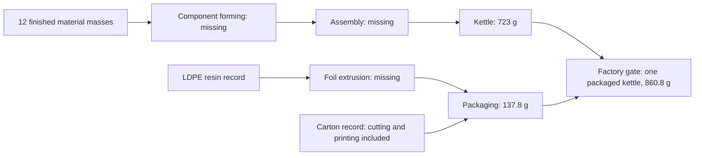

# BC1 electric kettle: TianGong archive screening

**Status:** This repository contains a traceable **partial diagnostic** using
historical TianGong data. It does not yet meet the classroom requirement for
a full kettle GWP100 total and an independent/revised comparison. The missing
data and checks are identified below.

## 1. Study identity and purpose

Run ID: `baseline-archive-20261008` (incomplete baseline screening; no revised
run). Study date: 2026-10-08 (Korea). Goal:
assess the factory-gate climate-change impact of one packaged 1 L electric
kettle and document where data are insufficient. Public student/group alias:
unknown because none was supplied for publication.
Repository: `https://github.com/KeyboardCon/LCA`. Intended class comparison:
GWP100 per packaged kettle. This is an **incomplete screening run**, not a
comparable final result. The first screening files are preserved in commit
`8f9428b903b6f6518169fa0913041f4138223ea3`; it is **not** a final
independent-run submission SHA. There is no complete-result Git tag or revised
run. The GitHub repository displayed `Public` when checked on 2026-10-08. A
prediction made before this calculation was not recorded.

## 2. Product, unit and boundary

Declared unit: one packaged BC1 simple plastic 1 L electric kettle at the
factory gate. The [classroom page](https://tiangong-lca-decision-lab.ecodino73.chatgpt.site/)
(reviewed from the PDF capture supplied by the user) attributes its bill of materials to the
*EU Electric Kettles preparatory study* (2020), Task 4, Tables 4-3, 4-4 and
4-8 (printed pp. 26, 27, 30). The transcribed [BOM](data/bom.csv) is 723 g kettle plus 137.8 g
packaging, or 860.8 g total. The intended boundary includes raw materials,
component manufacture, assembly and packaging. Customer delivery, use and
end of life are excluded. No intentional mass or impact cut-off was chosen;
unmodeled stages are data gaps. The archival background processes are CN;
the actual kettle production location and reference year are unknown. Heating
power, voltage and other commercial specifications are also unknown because
BC1 is a representative base case, not a named product. Only selected
background processes' direct emissions are characterized in this screening.
The selected carton process includes cutting, printing and packaging, but its
upstream cardboard and electricity remain unresolved. Other component
forming, assembly and LDPE film extrusion are unmodeled.



The arrows show the intended physical system. The calculation below uses
only direct exchanges from provisional background records, not all arrows.

## 3. Foreground inventory and assumptions

All 12 finished masses are sourced from the classroom PDF and entered in the
BOM. The table separates those source values from assumptions and gaps:

| Input or parameter | Value | Unit | Evidence | Status |
| --- | ---: | --- | --- | --- |
| Stainless steel, brass, copper, PP, PVC, nylon, POM, PC, ABS, silicone | Individual values in [BOM](data/bom.csv); 723 total | g/kettle | Classroom PDF, EU 2020 Task 4 tables | Sourced finished masses |
| LDPE foil, cardboard | 6.30, 131.50 | g/kettle | Same BOM; 137.80 total | Sourced finished masses |
| Selected process scaling yield | 100 | % of finished mass | No measured losses supplied | Assumed for **direct-exchange screening only** |
| Real process yields, purchase masses and grade | Unknown | kg, % | Not specified in BOM | Missing; no purchase inventory claimed |
| Molding, metal forming, LDPE film extrusion | Unknown | per kettle | Not specified | Missing |
| Carton cutting, printing and packaging | Included in selected background process | per 1000 kg cartons | TianGong carton dataset `b0a8d882-9859-4069-b59b-90dd19dc98a0` | Provisional; upstream inputs unresolved |
| Assembly electricity | Unknown | kWh/kettle | PDF states it is not specified | Missing |
| Supply-chain and factory transport | Unknown | kg·km/kettle | Not specified | Missing |
| Scrap, recycling route and credits | Unknown | kg/kettle | Not specified | Missing; no credits applied |
| Prices | Not applicable | currency | No monetary proxy used | Not applicable |

The script uses `mass_g / 1000 / reference_amount_kg` to scale each unit
process. The assumed 100% scaling does not establish real purchase quantities.
No separate foreground forming or energy process is added. The carton
dataset already includes some conversion and an electricity input, so a
future carton conversion step could double count them. Other process
boundaries also need review before adding conversion services. Missing
burdens are **unknown**, not zero.

## 4. Data and matching

Background source: archived `tiangong-lca/data` release `0.2.0`, Git commit
`c50cab7961e0b0ca11c26a600bd4c90fea6c6c32`. Its README states that
maintenance and GitHub release downloads ended on 2026-06-21; current data
are available from the TianGong platform. The source [match decisions](data/matches.csv),
generated [12-item BOM mapping table](results/mapping.csv) and
[search log](data/search_log.md) give inputs, queries, alternatives and
decisions. The [result manifest](results/baseline.json)
contains dataset names, UUIDs, versions, years, locations, reference flow
UUIDs/amounts in kg, source URLs, hashes and unresolved flow links. Files were
retrieved 2026-10-08. Seven material matches are provisional and five are
unmatched. The selected records are unit-process inventories (five single
operation, two black-box), **not cumulative cradle-to-gate factors**. Several
records explicitly lack upstream energy or feedstock data; an input-flow count
of zero in steel, brass or PP is **not** evidence of supplier closure. The JSON
lists known product input flow names/UUIDs with provider IDs set to `null`,
missing flow definitions, and non-reference product outputs. No actual
provider links were established. The selected copper XML has a broken
`#REF!` source link, so its underlying citation needs independent review.
USLCI was not searched in this run because the user selected TianGong; this
does not satisfy the page's instruction to compare both databases. Unmatched
inputs have no dataset ID, reference flow or file hash to report.

## 5. Calculation and impact method

[`assess.py`](assess.py) reads the local ILCD XML. For each provisionally
matched material, it scales the process to its finished mass, sums recorded
direct elementary output flows, and multiplies flow UUIDs by matching
characterization factors by **exact elementary-flow UUID**. In symbols, the
implemented partial calculation is
`h_direct = Σ_i (m_i / r_i) Σ_e (b_ie × CF_e)`, where `m_i` is the requested
mass in kg and `r_i` is process reference output in kg. It is **not** the
full `As=f; g=Bs; h=Cg` supply-chain calculation. The method is the archive's
Environmental Footprint `Climate change` GWP100, dataset version `01.00.000`,
UUID `6209b35f-9447-40b5-b68c-a1099e3674a0`, with a 100-year horizon and
kg CO2-equivalent unit.
The method XML describes an IPCC 2021 baseline and also references an older
source; the exact published EF edition is unknown. This script uses Python's
`Decimal` arithmetic; it has no matrix solver. Unit-process
upstream suppliers are **not solved** (`As=f` has not been assembled), so the
output is only a diagnostic of characterized direct emissions. Product-flow
inputs are listed as unresolved. No new allocation or cross-process system
model is applied. The copper source declares market-value allocation but also
outputs 2998 kg slag per 1000 kg reference copper; its allocation factor and
whether the listed emissions are already allocated are unverified. Recycling
credits are not applied. No selected characterized direct exchange is a
biogenic greenhouse gas; no separate biogenic carbon balance is modeled.
Exact UUID matching selects available archive factors. Other elementary
outputs without a GWP100 factor are listed in the JSON; some are non-climate
pollutants and their absence from this impact category does not itself prove
missing GWP. Exchange references with absent flow XML are reported separately
and cannot be classified. No unknown contribution is assigned zero. No
uncertainty distribution is fitted.

## 6. Reproduce

Verified on Linux with Python `3.12.14` and Git; calculation and tests use
only Python's standard library. Clone both repositories side by side. The archive checkout
is large (about 855 MB here). No account, API key, cache or random seed is
needed for this archived calculation.
The script checks that the data checkout is at the pinned commit and records
that the data tree has no local changes, then records hashes of every selected
process file and the characterization method. The manifest's retrieval date
is the date each run accesses the local checkout, in Asia/Seoul time.

```bash
git clone https://github.com/KeyboardCon/LCA.git
git clone https://github.com/tiangong-lca/data.git tiangong-data
git -C tiangong-data checkout c50cab7961e0b0ca11c26a600bd4c90fea6c6c32
cd LCA
python3 -m unittest -v test_assess.py
python3 assess.py --dataset ../tiangong-data/tiangong_lca_data \
  --output results/baseline.json --mapping-output results/mapping.csv
```

Repository map: `data/bom.csv` has inputs, `data/matches.csv` has selected
processes, `data/search_log.md` has alternatives, `assess.py` calculates,
`test_assess.py` validates, `results/mapping.csv` is the full input mapping,
and `results/baseline.json` is the output manifest.
Open the JSON in an editor. The XML is referenced by commit and hash, not
copied into this coursework repository. For current TianGong Production,
use the official CLI with its bundled public configuration. Live retrieval
needs allowed network access to the Production Supabase host and a human
browser OAuth login. Official Production needs no environment variable; a
custom environment would require matching
`TIANGONG_LCA_API_BASE_URL`, `TIANGONG_LCA_SUPABASE_PUBLISHABLE_KEY`, and
`TIANGONG_LCA_OAUTH_CLIENT_ID` values from its administrator. No value or
credential belongs in this repository.
The current Production dataset and the classroom website were inaccessible
to this cloud run. The PDF supplied the classroom conditions instead. No
restricted raw dataset or credential is redistributed here. Dataset access
and any further redistribution remain subject to the upstream XML and
platform permissions; the generated CSV contains metadata and IDs only.

## 7. Results, checks and interpretation

**Full GWP100: not calculated.** The JSON contains `null` for the total,
because five materials, manufacturing operations and upstream suppliers are
unresolved. The characterized direct-emission **subtotal of selected unit
processes** is `0.0331150182 kg CO2-eq` per packaged kettle, of which
`0.033054450` is normalized from the selected copper record and `0.0000605682`
from the selected LDPE record. The copper number is **not confirmed as
attributable solely to copper** because its slag output and allocation are
unresolved. The other selected process records have no factor-matched direct
GWP exchange in this calculation; their full burdens are unknown. This subtotal
cannot be interpreted as the kettle footprint or a lower bound.
There are no defensible top-three contributors to the complete product.

| Material | Selected-record direct diagnostic (kg CO2-eq/kettle) | Full material burden |
| --- | ---: | --- |
| Copper | 0.033054450 before verified slag allocation | Unknown: 8 unresolved product inputs |
| LDPE foil | 0.0000605682 | Unknown: 2 unresolved product inputs; film conversion absent |
| Steel, brass, PP, PVC, cardboard | No factor-matched direct GWP exchange | Unknown: process and supplier gaps; some flow XML absent |
| Nylon, POM, PC, ABS, silicone | Not calculated | No accepted process match |

These rows sum to the **direct subtotal only**; they are not a complete
contribution breakdown. No figure was generated because there is no complete
total to plot. This is an archived TianGong baseline; no USLCI or alternative
method scenario was calculated.

Checks: BOM mass and selected product-reference kg units pass; this is not a
full exchange-unit audit. The direct diagnostic equals the sum of its recorded
factor-matched exchanges. Supplier closure fails, some flow definitions are
absent, and allocation remains unverified. The full double-counting check
cannot pass without conversion-service data; carton cutting and printing need
an explicit overlap check before adding any separate carton service. Major
known gaps include upstream supply, five unmatched materials, and forming;
their relative sizes are unknown. CN historical processes are imperfect proxies for an
unspecified kettle production region and year.

## 8. Uncertainty and sensitivity

Not calculated because the baseline is incomplete. No probability ranges,
Monte Carlo draws, seed, or P05/P95 are reported. Alternate steel, copper,
PP, PVC and cardboard process choices are recorded in the search log for a
future scenario; they are not presented as a revised numerical result.
Parameter uncertainty, correlations, provider/method scenarios and
variability between repeated AI runs have not been quantified. A central
90% interval or convergence claim would therefore be unsupported.

## 9. Codex and human decisions

Codex (GPT-6; exact build/settings unknown) prepared the project on
2026-10-08. The user selected the
webpage's kettle task and TianGong as the database, then supplied the page as
a PDF and pointed to the TianGong GitHub organization. Codex selected the
provisional process matches, retained missing values, and implemented the
checks. The user provided the PDF and requested a final README audit; the
assistant transcribed the BOM, revised the README and reran the checks. No
independent human validation of the model or final numerical result has been
recorded. A separate Codex technical audit reproduced the two nonzero direct
terms and identified the allocation and missing-flow caveats. The user has
not yet reviewed or accepted the matches. The
[prompt and decision log](PROMPTS.md) records consequential requests and
choices; the [search log](data/search_log.md) records process alternatives.
Private messages and credentials are not included.

## 10. Independent and revised runs

The preliminary screening JSON is preserved at commit
`8f9428b903b6f6518169fa0913041f4138223ea3`. An independent **complete**
result has not been produced, tagged, submitted or compared with classmates.
No revised run was made, so a prior-result comparison, one changed decision,
predicted effect, absolute/percentage change and revised commit are **not
applicable yet**. A later revision must preserve the first complete result
and distinguish error correction from a defensible modeling alternative.
